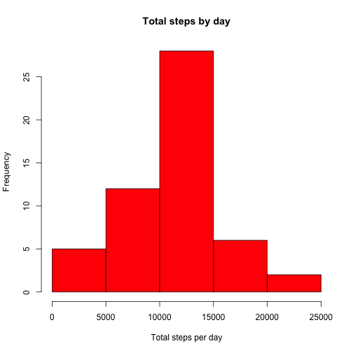
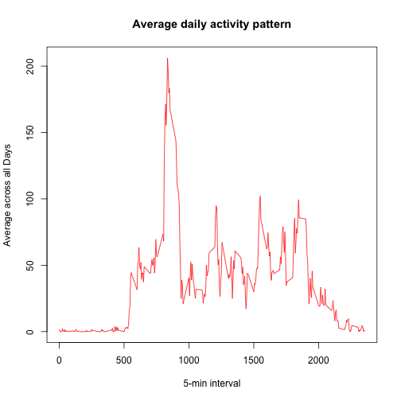
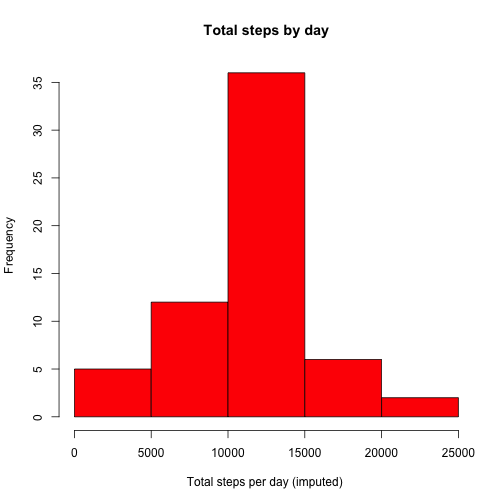
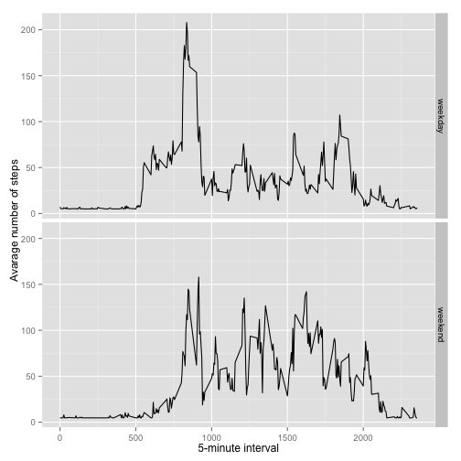

# Rerproductive Research: Peer Assessment 1

## Import packages

```r
library(ggplot2)
library(stats)
library(Hmisc)
```

```
## Loading required package: grid
## Loading required package: lattice
## Loading required package: survival
## Loading required package: Formula
## 
## Attaching package: 'Hmisc'
## 
## The following objects are masked from 'package:base':
## 
##     format.pval, round.POSIXt, trunc.POSIXt, units
```


## Load the data

```r
if(!file.exists('activity.csv')){
    unzip('repdata-data-activity.zip')
}
activity <- read.csv('activity.csv')
```

```r
summary(activity)
```

```
##      steps                date          interval     
##  Min.   :  0.00   2012-10-01:  288   Min.   :   0.0  
##  1st Qu.:  0.00   2012-10-02:  288   1st Qu.: 588.8  
##  Median :  0.00   2012-10-03:  288   Median :1177.5  
##  Mean   : 37.38   2012-10-04:  288   Mean   :1177.5  
##  3rd Qu.: 12.00   2012-10-05:  288   3rd Qu.:1766.2  
##  Max.   :806.00   2012-10-06:  288   Max.   :2355.0  
##  NA's   :2304     (Other)   :15840
```

```r
head(activity)
```

```
##   steps       date interval
## 1    NA 2012-10-01        0
## 2    NA 2012-10-01        5
## 3    NA 2012-10-01       10
## 4    NA 2012-10-01       15
## 5    NA 2012-10-01       20
## 6    NA 2012-10-01       25
```


## Preprocessing the data

```r
activity$date = as.Date(activity$date, "%Y-%m-%d")
```


## What is mean total number of steps taken per day?

```r
stepsByDay <- aggregate(steps ~ date, data = activity, sum, na.rm = TRUE)
hist(stepsByDay$steps, main = "Total steps by day", xlab = "Total steps per day", col = "red")
```

 

```r
stepsByDayMean <- mean(stepsByDay$steps)
stepsByDayMedian <- median(stepsByDay$steps)
```
* Mean: 1.0766189 &times; 10<sup>4</sup>
* Median:  10765


## What is the average daily activity pattern?

```r
timeSeries <- tapply(activity$steps, activity$interval, mean, na.rm = TRUE)
plot(row.names(timeSeries), timeSeries, type = "l", xlab = "5-min interval", ylab = "Average across all Days", main = "Average daily activity pattern", col = "red")
```

 

#### Which 5-minute interval, on average across all the days in the dataset, contains the maximum number of steps?

```r
max_interval <- which.max(timeSeries)
names(max_interval)
```

```
## [1] "835"
```


## Impute missing values

#### 1. Calculate and report the total number of missing values in the dataset (i.e. the total number of rows with NAs)

```r
sum(is.na(activity$steps))
```

```
## [1] 2304
```

#### 2. Devise a strategy for filling in all of the missing values in the dataset. The strategy does not need to be sophisticated. For example, you could use the mean/median for that day, or the mean for that 5-minute interval, etc. Create a new dataset that is equal to the original dataset but with the missing data filled in.

```r
activityImputed <- activity
activityImputed$steps <- impute(activity$steps, fun=mean)
```

#### 3. Make a histogram of the total number of steps taken each day and Calculate and report the mean and median total number of steps taken per day. Do these values differ from the estimates from the first part of the assignment? What is the impact of imputing missing data on the estimates of the total daily number of steps?

```r
stepsByDayImputed <- aggregate(steps ~ date, data = activityImputed, sum, na.rm = TRUE)
hist(stepsByDayImputed$steps, main = "Total steps by day", xlab = "Total steps per day (imputed) ", col = "red")
```

 

```r
stepsByDayMeanImputed <- mean(stepsByDayImputed$steps)
stepsByDayMedianImputed <- median(stepsByDayImputed$steps)
```
* Mean (Imputed): 1.0766189 &times; 10<sup>4</sup>
* Median (Imputed):  1.0766189 &times; 10<sup>4</sup>

#### After replacing the mean is the same but the median is slightly different.

## Are there differences in activity patterns between weekdays and weekends?

#### 1. Create a new factor variable in the dataset with two levels – “weekday” and “weekend” indicating whether a given date is a weekday or weekend day.

```r
activityImputed$wday <- ifelse(weekdays(activityImputed$date) %in% c("Sunday","Saturday"), "weekend", "weekday")
```

##### 2. Make a panel plot containing a time series plot

```r
timeSeriesImputed <- aggregate(steps ~ interval + wday, activityImputed, mean)
ggplot(timeSeriesImputed, aes(interval, steps)) + 
    geom_line() + 
    facet_grid(wday ~ .) +
    xlab("5-minute interval") + 
    ylab("Avarage number of steps")
```

 
